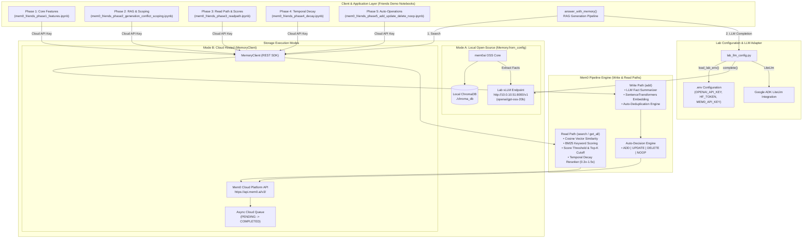
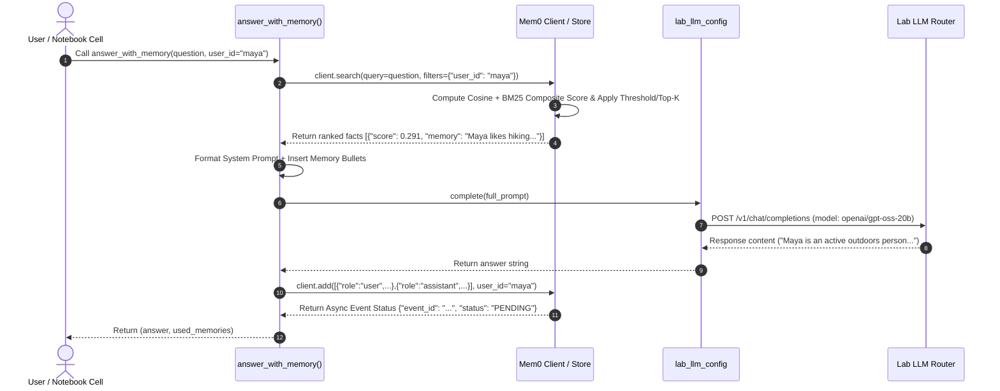
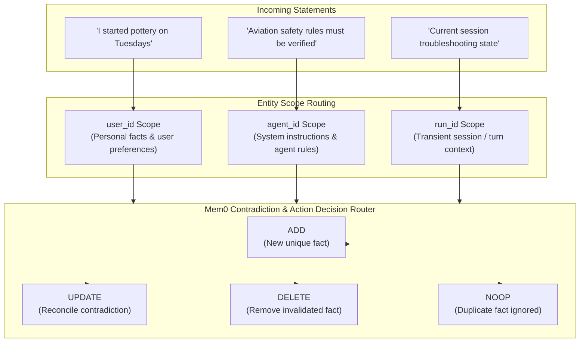

# 🧠 Mem0 Friends Demo — Architecture & Component Diagram

This document presents the system architecture, component layout, data flow, and read/write path lifecycles strictly for the **Mem0 Friends Demo Series (Phases 1–5)**.

---

## 1. High-Level System Architecture Diagram

---

## 2. End-to-End RAG Generation & Memory Flow (`answer_with_memory`)

---

## 3. Multi-Entity Scope Architecture & Auto-Decision Router

---

## 4. Key Component Matrix

| Component | Path / Notebook | Responsibilities | Key API Syntax |
| :--- | :--- | :--- | :--- |
| **Lab LLM Config** | [`lab_llm_config.py`](file:///Users/sangeetha/SV-Summer2026/agents/lab/mem0_lite/lab_llm_config.py) | Environment loading, endpoint config, LLM completion, telemetry suppression. | `load_lab_env()`, `complete(prompt)` |
| **Phase 1 Demo** | `mem0_friends_phase1_features.ipynb` | Full CRUD lifecycle, user isolation, metadata filtering. | `client.add()`, `get_all()`, `update()`, `delete()` |
| **Phase 2 Demo** | `mem0_friends_phase2_generation_conflict_scoping.ipynb` | RAG answer generation & multi-entity scoping (`user_id`, `agent_id`, `run_id`). | `answer_with_memory()`, `filters={"user_id": ...}` |
| **Phase 3 Demo** | `mem0_friends_phase3_readpath.ipynb` | Read path inspection, composite scoring ($0.05$ to $0.35$), score thresholding & Top-K limits. | `client.search(query, filters=..., top_k=...)` |
| **Phase 4 Demo** | `mem0_friends_phase4_decay.ipynb` | Time-weighted recency & access frequency decay (`0.3x` to `1.5x` score multipliers). | `client.project.update(decay=True)` |
| **Phase 5 Demo** | `mem0_friends_phase5_add_update_delete_noop.ipynb` | Automatic contradiction resolution & action classification (`ADD`, `UPDATE`, `DELETE`, `NOOP`). | `client.add(message, user_id=...)` |
