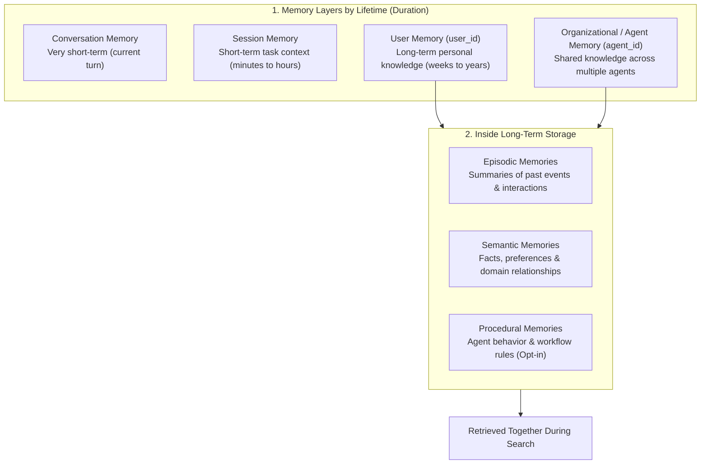
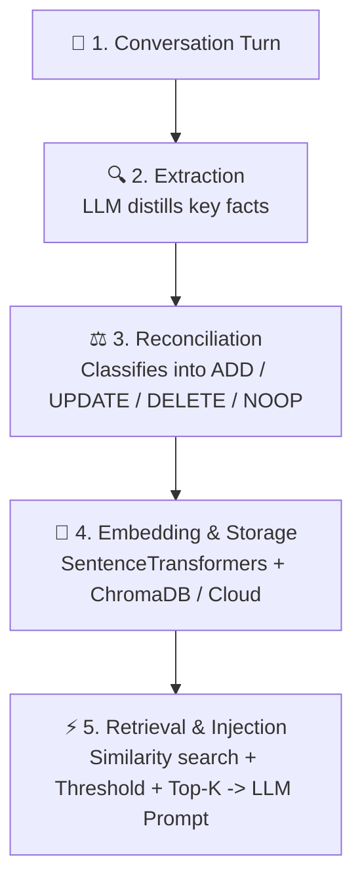

# 🧠 Understanding Mem0: The AI Memory Layer

A comprehensive overview of what **Mem0** is, the problem it solves compared to standard RAG pipelines, how layers are structured by lifetime, and how it works mechanically under the hood.

---

## 🎯 1. What Mem0 Is

**Mem0** is a persistent memory infrastructure layer that sits between conversation turns and Large Language Models (LLMs).

- **Persistent Context**: Enables AI agents to remember user preferences, facts, and state across sessions instead of starting fresh every turn.
- **Infrastructure, Not a Model**: It is not a new neural network or fine-tuned LLM — it is intelligent memory management infrastructure that decides what is worth remembering, stores it, and retrieves the relevant facts when needed.

---

## ⏳ 2. How Mem0 Organizes Memory: Lifetimes vs. Classic Types

Mem0 organizes memory into **layers based on lifetime** (how long a memory lasts). Within long-term storage, classic cognitive memory types are kept together:

### Key Lifetime Layers:
- 💬 **Conversation Memory**: Immediate turn context (very short-term).
- ⏱️ **Session Memory**: Task/session context (`run_id`, lasts minutes to hours).
- 👤 **User Memory**: Long-term personal knowledge tied to a person (`user_id`, lasts weeks or longer).
- 🏢 **Organizational / Agent Memory**: Shared rules & knowledge used by multiple agents (`agent_id`).

### Classic Memory Types Inside Long-Term Storage:
- Inside long-term storage, Mem0 stores **Episodic Memories** (past interaction summaries) and **Semantic Memories** (facts and relationships).
- Both episodic and semantic memories are kept in the same long-term layer and retrieved together during semantic search.
- **Summary**: *Mem0 separates layers by lifetime, and within long-term storage keeps episodic and semantic memories together.*

---

## 💡 3. The Problem Mem0 Solves: RAG vs. Mem0

| Feature | Standard RAG Pipeline | Mem0 Memory Infrastructure |
| :--- | :--- | :--- |
| **Data Direction** | **Read-Only** (queries static document chunks) | **Read & Write** (continuously learns from conversation turns) |
| **State Management** | **Stateless** (does not update what it knows about the user) | **Stateful** (updates, reconciles, or erases user facts over time) |
| **Core Concept** | Static Document Index | **Dynamic Memory Policy**: *Write $\rightarrow$ Read $\rightarrow$ Consolidate $\rightarrow$ Forget* |

> **Why it matters**: In a standard RAG pipeline, if a user tells an assistant *"I moved from Seattle to San Francisco"* today, the system has no mechanism to update its knowledge tomorrow. Mem0 turns memory into an active policy layer that automatically updates user state.

---

## ⚙️ 4. How Mem0 Works Mechanically

### The 4-Step Pipeline:

1. **Extraction (LLM Summarization)**  
   - An LLM reads a raw conversation turn (plus recent dialogue context) and distills the facts actually worth keeping, rather than storing raw text verbatim.
2. **Reconciliation (Contradiction & Action Decision)**  
   - Every newly extracted fact is compared against existing memories and classified into one of four operations:
     - **`ADD`**: New, unique fact detected.
     - **`UPDATE`**: Correction or update to an existing fact.
     - **`DELETE`**: Contradictory or invalidated fact removed.
     - **`NOOP`**: Duplicate fact ignored to prevent clutter.
3. **Embedding & Storage**  
   - Accepted facts are vectorized using embedding models (`sentence-transformers/all-MiniLM-L6-v2`) and stored in a vector database (ChromaDB or Graph store in `Mem0g`).
4. **Retrieval & Injection**  
   - When a new question arrives, the query is embedded, matched via cosine similarity + BM25 scoring, filtered by `threshold` and `top_k`, and injected into the LLM system prompt context.
