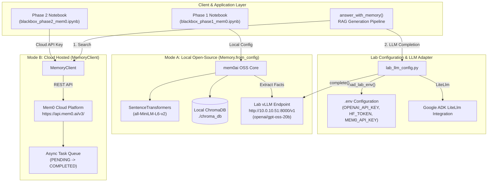
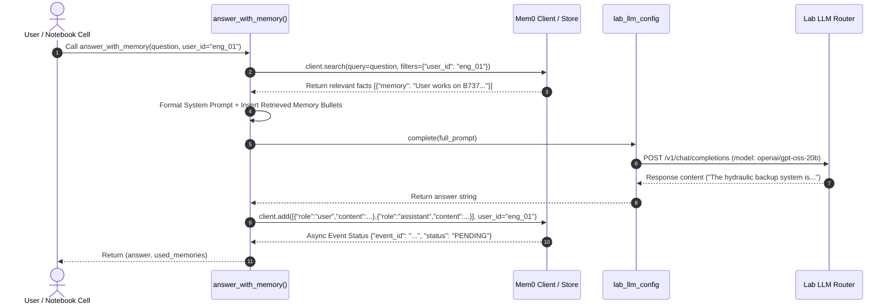
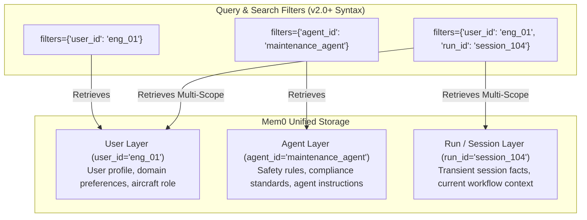

# Mem0 Architecture & System Component Diagram

This document presents the system architecture, component layout, and data flow across both **Local Open-Source (`Memory`)** and **Cloud Hosted (`MemoryClient`)** modes in the lab environment.

---

## 1. High-Level System Architecture Diagram

---

## 2. End-to-End Generation & Memory Flow (`answer_with_memory`)

---

## 3. Scope & Filter Architecture (`user_id`, `agent_id`, `run_id`)

Mem0 segments memory into distinct layers using entity scopes:

---

## 4. Key Component Matrix

| Component | Path / Function | Responsibilities | Key API Syntax |
| :--- | :--- | :--- | :--- |
| **Lab LLM Config** | [`lab_llm_config.py`](file:///Users/sangeetha/SV-Summer2026/agents/lab/mem0_lite/lab_llm_config.py) | Environment loading, lab endpoint configuration, LLM completion, telemetry suppression. | `load_lab_env()`, `complete(prompt)` |
| **Local Mem0** | [`blackbox_phase1_mem0.ipynb`](file:///Users/sangeetha/SV-Summer2026/agents/lab/mem0_lite/docs/notebooks/blackbox_phase1_mem0.ipynb) | Local memory management via ChromaDB & HuggingFace embeddings. | `Memory.from_config(config)` |
| **Cloud Mem0** | [`blackbox_phase2_mem0.ipynb`](file:///Users/sangeetha/SV-Summer2026/agents/lab/mem0_lite/docs/notebooks/blackbox_phase2_mem0.ipynb) | Hosted Mem0 API client for cloud storage & async memory extraction. | `MemoryClient(api_key=...)` |
| **Memory Extraction (`add`)** | `client.add(...)` | Accepts raw dialogue, uses LLM to extract key facts, writes to vector store. | `client.add(messages, user_id="...")` *(Top-level entity param)* |
| **Memory Listing (`get_all`)** | `client.get_all(...)` | Retrieves all stored facts within a given entity scope. | `client.get_all(filters={"user_id": "..."})` *(Dictionary filter)* |
| **Memory Search (`search`)** | `client.search(...)` | Performs semantic search against stored memory vectors. | `client.search(query, filters={"user_id": "..."})` *(Dictionary filter)* |
