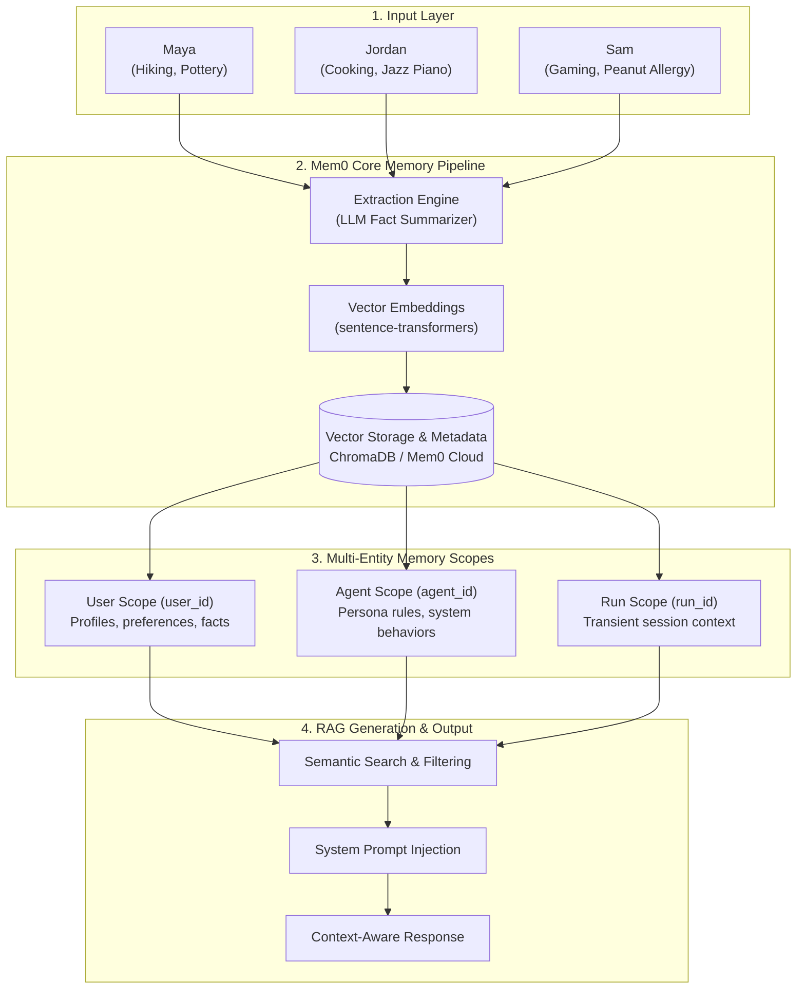
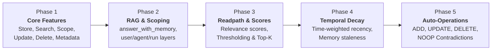

# 🧠 Mem0 AI Memory Architecture — Live Demo Overview

> **Presentation & Showcase Guide**  
> *A 5-Phase Walkthrough of Long-Term Memory for AI Agents*

---

## 🎯 Executive Summary & Purpose

Standard LLMs are **stateless** — every new conversation resets context.  
**Mem0** provides a persistent, dynamic memory layer that allows AI applications to:
1. **Extract Facts Automatically**: Convert raw conversations into structured user facts.
2. **Search by Meaning**: Perform semantic retrieval across user histories.
3. **Scope & Isolate Data**: Keep individual user, agent, and session memories strictly segregated.
4. **Resolve Conflicts**: Reconcile changing user preferences over time.

---

## 🏗️ 1. High-Level System Architecture



---

## 🗺️ 2. The 5-Phase Demo Roadmap



---

## 👥 3. Live Demo Character Profiles (User Isolation Showcase)

During the demo, three friends illustrate strict user memory isolation:

| Friend | Stored Facts | Memory Scope Filter |
| :--- | :--- | :--- |
| **Maya** | 🏔️ Hiking in Rockies \| 🏺 Pottery class on Tuesdays | `filters={"user_id": "maya"}` |
| **Jordan** | 🍳 Cooking Italian dinners \| 🎹 Plays jazz piano | `filters={"user_id": "jordan"}` |
| **Sam** | 🎮 Plays video games \| 🥜 Peanut allergy (Safety critical) | `filters={"user_id": "sam"}` |

> [!IMPORTANT]
> **Key Showcase Highlight**: Running the exact same query (*"What are this person's hobbies?"*) returns 3 completely different, isolated responses based strictly on `user_id`.

---

## 🔬 4. Deep-Dive Phase Breakdown

### Phase 1: Core Memory Lifecycle
- **What to show**: `client.add()`, `client.search()`, `client.update()`, `client.delete()`.
- **Key Takeaway**: Raw dialogue goes in $\rightarrow$ Mem0 extracts clean facts $\rightarrow$ full CRUD control via `memory_id`.

### Phase 2: RAG Generation & Multi-Entity Scoping
- **What to show**: `answer_with_memory()` combining retrieval with LLM answer generation.
- **Key Takeaway**: Segregating rules at `user_id` (personal preferences), `agent_id` (agent behavior), and `run_id` (session context).

### Phase 3: Readpath & Score Distributions
- **What to show**: Semantic relevance scoring ($0.05$ to $0.35$ scale) and score threshold filtering.
- **Key Takeaway**: Combining custom threshold filtering with Top-K limits prevents prompt noise.

### Phase 4: Temporal Decay & Recency
- **What to show**: How time weighting affects memory priority over days, weeks, and months.
- **Key Takeaway**: Recent events naturally take priority over older historical memories.

### Phase 5: Automatic Operations (ADD / UPDATE / DELETE / NOOP)
- **What to show**: Mem0's decision engine when receiving new facts that contradict or duplicate old memories.
- **Key Takeaway**: Distinguishing when Mem0 updates automatically vs. when explicit `update()` calls are needed.

---

## 💡 Quick Reference: Correct API Cheat-Sheet

```python
# 1. Store Memory (user_id is top-level)
client.add("I'm learning pottery on Tuesdays.", user_id="maya")

# 2. Get All Memories (user_id is inside filters dict)
client.get_all(filters={"user_id": "maya"})

# 3. Search Memories (user_id is inside filters dict)
client.search("What are her hobbies?", filters={"user_id": "maya"})

# 4. RAG Generation (Retrieve -> Inject -> Complete)
memories = client.search(question, filters={"user_id": user_id})
answer = complete(f"Context:\n{memories}\n\nQuestion: {question}")
```
