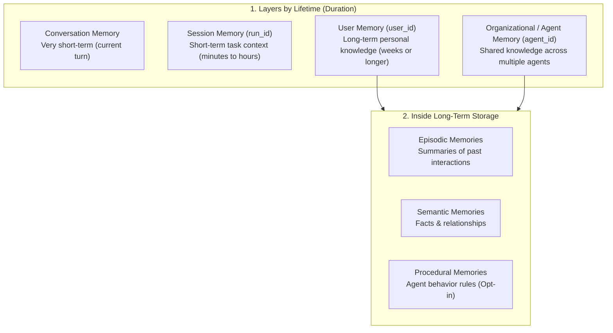
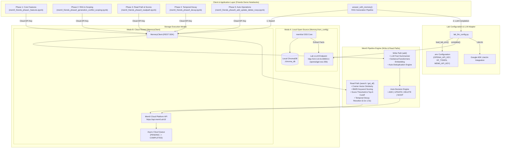
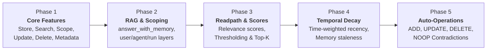

# 🌟 Mem0 Friends Demo — Complete Executive Overview

> **Presentation & Showcase Guide**  
> *A 5-Phase Walkthrough of Long-Term AI Memory for AI Agents*

---

## 🎯 Purpose & Story Overview

Standard LLMs are **stateless** — every new conversation resets context.  
**Mem0** provides a persistent, dynamic memory layer that allows AI applications to:
1. **Extract Facts Automatically**: Convert raw conversations into structured user facts.
2. **Search by Meaning**: Perform semantic retrieval across user histories.
3. **Scope & Isolate Data**: Keep individual user, agent, and session memories strictly segregated.
4. **Resolve Conflicts**: Reconcile changing user preferences over time.

### 👥 The Demo Characters & User Isolation
Throughout the demo, three friends illustrate strict user memory isolation:
- 🏔️ **Maya**: Hikes in the Rockies, takes pottery on Tuesdays, later switches to painting.
- 🍳 **Jordan**: Cooks Italian dinners, plays jazz piano to unwind.
- 🥜 **Sam**: Plays video games, has a **peanut allergy** (safety-critical constraint).

---

## ⏳ Memory Organization: Lifetime Layers vs. Storage Types

Mem0 separates memory into **layers based on lifetime (duration)**, while keeping classic memory types stored together inside long-term storage:



### Breakdown:
1. **Memory Layers by Lifetime**:
   - **Conversation Memory**: Current turn context (very short-term).
   - **Session Memory (`run_id`)**: Task context (minutes to hours).
   - **User Memory (`user_id`)**: Personal facts tied to a person (weeks or longer).
   - **Organizational / Agent Memory (`agent_id`)**: Shared rules across agents.
2. **Inside Long-Term Storage**:
   - Mem0 stores classic **Episodic Memories** (summaries of past events) and **Semantic Memories** (facts and relationships) together in long-term storage.
   - When searching, both episodic and semantic memories are retrieved together.

---

## 🏗️ High-Level Architecture Diagram



---

## 🗺️ The 5-Phase Demo Roadmap



---

## 🚀 5-Phase Walkthrough Details

### 1️⃣ Phase 1 — Core Features & Lifecycle ([mem0_friends_phase1_features.ipynb](file:///Users/sangeetha/SV-Summer2026/agents/lab/mem0_lite/docs/notebooks/mem0_friends_phase1_features.ipynb))
- **Automatic Fact Extraction**: Pass raw chat sentences $\rightarrow$ Mem0 extracts clean facts automatically.
- **Strict User Isolation**: `user_id` ensures Maya's, Jordan's, and Sam's memories never cross paths.
- **Explicit CRUD**: `update()` and `delete()` memories in-place using `memory_id`.
- **Metadata Tagging**: Filter memories by custom key-value pairs (e.g. `topic: "cooking"`).

### 2️⃣ Phase 2 — RAG Generation & Multi-Entity Scoping ([mem0_friends_phase2_generation_conflict_scoping.ipynb](file:///Users/sangeetha/SV-Summer2026/agents/lab/mem0_lite/docs/notebooks/mem0_friends_phase2_generation_conflict_scoping.ipynb))
- **`answer_with_memory()`**: Combine vector retrieval with LLM completion to answer questions naturally.
- **Multi-Entity Layers**: Segregate preferences into `user_id` (personal facts), `agent_id` (system compliance/safety rules), and `run_id` (transient session history).

### 3️⃣ Phase 3 — The Read Path & Score Tuning ([mem0_friends_phase3_readpath.ipynb](file:///Users/sangeetha/SV-Summer2026/agents/lab/mem0_lite/docs/notebooks/mem0_friends_phase3_readpath.ipynb))
- **Inspect Scores**: View composite similarity scores ($0.05$ to $0.35$ scale).
- **Thresholding & Top-K**: Use a score cutoff (e.g. `0.25`) + `top_k` limit to keep prompt context clean.

### 4️⃣ Phase 4 — Temporal Decay & Recency ([mem0_friends_phase4_decay.ipynb](file:///Users/sangeetha/SV-Summer2026/agents/lab/mem0_lite/docs/notebooks/mem0_friends_phase4_decay.ipynb))
- **Time-Weighted Recency**: Enable `decay=True`. Frequently accessed/recent memories get up to a `1.5x` score boost, while idle memories dampen toward `0.3x`.

### 5️⃣ Phase 5 — Automatic Operations ([mem0_friends_phase5_add_update_delete_noop.ipynb](file:///Users/sangeetha/SV-Summer2026/agents/lab/mem0_lite/docs/notebooks/mem0_friends_phase5_add_update_delete_noop.ipynb))
- **Auto-Reconciliation**: Watch Mem0 classify incoming statements into `ADD`, `UPDATE`, `DELETE`, or `NOOP` when facts change or repeat.

---

## 💡 Quick API Cheat-Sheet

```python
# 1. Store Semantic/Episodic Memory (Default - user_id is top-level)
client.add("I'm learning pottery on Tuesdays.", user_id="maya")

# 2. Store Procedural Memory (Opt-in - requires agent_id)
client.add(
    "Always double-check safety specifications.",
    agent_id="maintenance_agent",
    memory_type="procedural_memory",
)

# 3. Get All Memories (filters dict)
client.get_all(filters={"user_id": "maya"})

# 4. Search Memories (filters dict)
client.search("What are her hobbies?", filters={"user_id": "maya"})

# 5. RAG Generation (Retrieve -> Inject -> Complete)
memories = client.search(question, filters={"user_id": user_id})
answer = complete(f"Context:\n{memories}\n\nQuestion: {question}")
```
